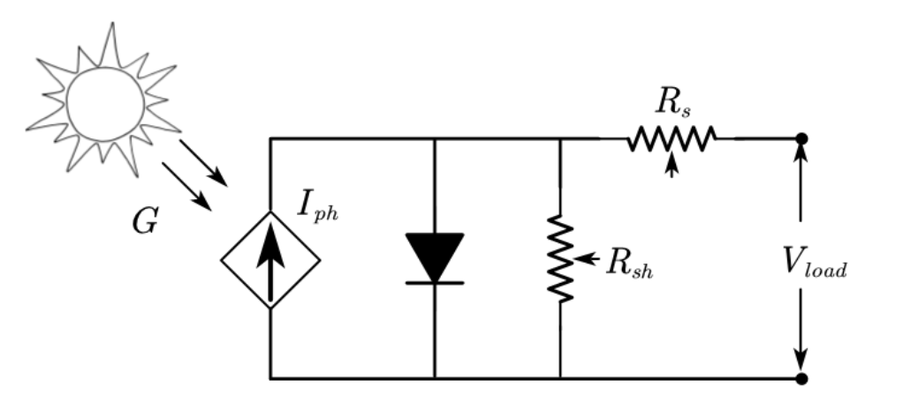
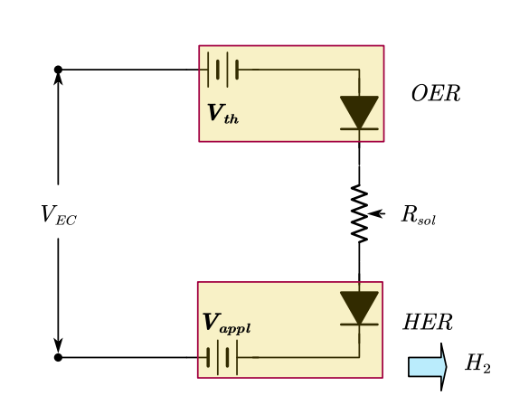
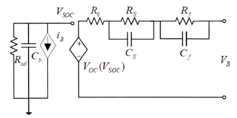
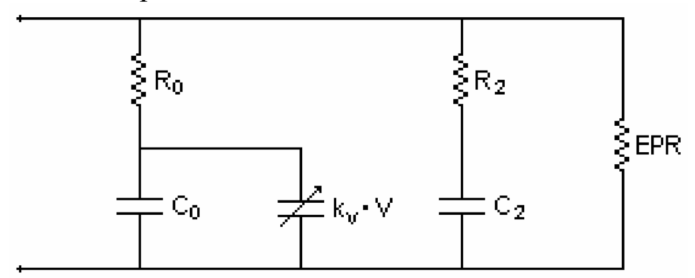

# Electrochemistry System

## PhotovoltaicCell

To use `PhotovoltaicCell()`, we design a resistor called `vari_Resistor` whose resistance value changes with time. Then we can see the I-U curve of `PhotovoltaicCell` with different loads.

Equivalent circuit diagram of `PhotovoltaicCell()`:

  

```@example 1
using Ai4EComponentLib
using ModelingToolkit, DifferentialEquations
using Ai4EComponentLib.Electrochemistry
using Plots

function vari_Resistor(; name)
    @named oneport = OnePort()
    @unpack v, i = oneport
    eqs = [
        v ~ i * t
    ]
    extend(ODESystem(eqs, t, [], []; name=name), oneport)
end

@named Pv = PhotovoltaicCell()
@named R = vari_Resistor()
@named ground = Ground()

eqs = [
    connect(Pv.p, R.p)
    connect(Pv.n, R.n, ground.g)
]

@named OdeFun = ODESystem(eqs, t)
@named model = compose(OdeFun, [Pv, R, ground])
sys = structural_simplify(model)
prob = ODEProblem(sys, [], (0.0, 300.0))
sol = solve(prob)
```

```@example 1
plot(sol[R.p.v], sol[R.p.i], color = "red")
savefig("example_1.svg"); nothing # hide
```


## PEMElectrolyzer

Using above PhotovoltaicCell to drive Electrolyzer, then we build a *PVEL system*. In default paraments, we can know how the system works.


Equivalent circuit diagram of `PEMElectrolyzer()`:

  

```@example 2
using ModelingToolkit, DifferentialEquations
using Ai4EComponentLib
using Ai4EComponentLib.Electrochemistry

@named Pv = PhotovoltaicCell()
@named El = PEMElectrolyzer()
@named ground = Ground()
eqs = [
    connect(Pv.p, El.p)
    connect(Pv.n, El.n, ground.g)
]
@named OdeFun = ODESystem(eqs, t)
@named model = compose(OdeFun, [Pv, El, ground])
sys = structural_simplify(model)
u0 = [
    El.m_H_2 => 0.0
    El.∂_m_H_2 => 0.0
]
prob = ODEProblem(sys, u0, (0.0, 30.0))
sol = solve(prob)
```

Get states of system by `states()`

```@example 2
states(sys)
```

Check voltage, current and mass yield of electrolyzer. The working point `(El.v,El.i)` can be found in I-U curve above.

```@example 2
sol[El.v]
```

```@example 2
sol[El.i]
```

```@example 2
sol[El.m_H_2]
```

## Lithium battery

Equivalent circuit diagram of `Lithium_ion_batteries()`:

  

```@example 3
using ModelingToolkit, DifferentialEquations
using Ai4EComponentLib
using Ai4EComponentLib.Electrochemistry
using Plots

@named batter = Lithium_ion_batteries()
@named Pv = PhotovoltaicCell()
@named ground = Ground()

eqs = [
    connect(batter.p, Pv.p)
    connect(batter.n, Pv.n, ground.g)
]

@named OdeFun = ODESystem(eqs, t)
@named model = compose(OdeFun, [Pv, batter, ground])
sys = structural_simplify(model)
u0 = [
    batter.v_f => 0.5
    batter.v_s => 0.5
    batter.v_soc => 0.5
]
prob = ODEProblem(sys, u0, (0.0, 3600.0))
sol = solve(prob)
```

```@example 3
plot(sol.t, sol[batter.v_soc], color = "red")
savefig("example_3_1.svg"); nothing # hide
```


```@example 3
plot(sol.t, sol[batter.v_s], color = "red")
savefig("example_3_2.svg"); nothing # hide
```


```@example 3
plot(sol.t, sol[batter.i_b], color = "red")
savefig("example_3_3.svg"); nothing # hide
```


## Super capacity

Equivalent circuit diagram of `Super_capacity()`:

  

```@example 4
using Ai4EComponentLib
using ModelingToolkit, DifferentialEquations
using Ai4EComponentLib.Electrochemistry
using Plots

function charge_controller(; name)
    @named oneport = OnePort()
    @unpack v, i = oneport
    eqs = [∂(i) ~ 0]
    events = [
        [t ~ 5.0] => [i ~ -10],
        [t ~ 36.7] => [i ~ 0],
    ]
    return extend(ODESystem(eqs, t, [], []; name=name, continuous_events=events), oneport)
end

@named ground = Ground()
@named sc = Super_capacity()
@named cg = charge_controller()
eqs = [
    connect(sc.p, cg.p)
    connect(sc.n, cg.n, ground.g)
]

@named OdeFun = ODESystem(eqs, t)
@named model = compose(OdeFun, [sc, cg, ground])
sys = structural_simplify(model)
u0 = [
    sc.v_0 => 0.0
    sc.v_2 => 0.0
    cg.i   => 0.0
]

prob = ODEProblem(sys, u0, (0.0, 600))
sol = solve(prob)
```

  

