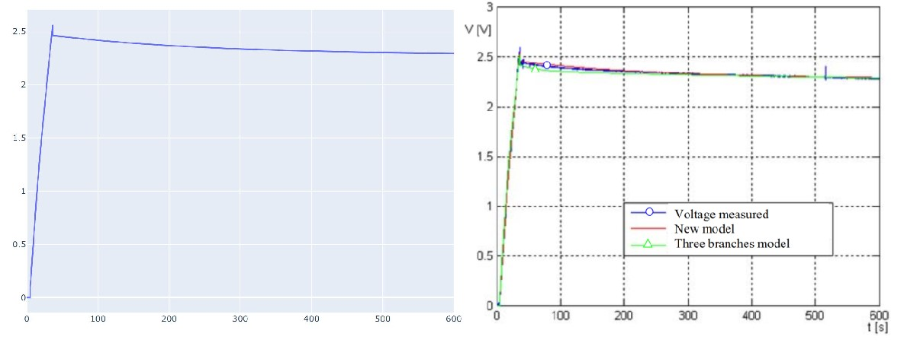
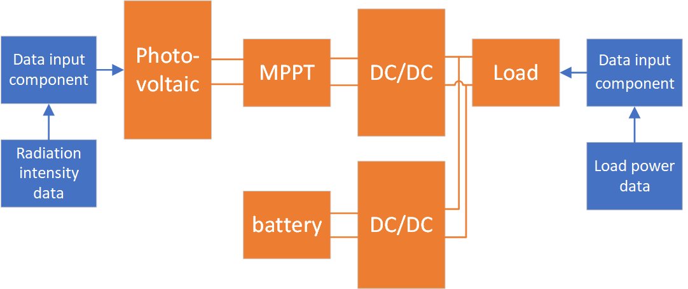

# Electrochemistry System

## PhotovoltaicCell

To use `PhotovoltaicCell()`, we design a resistor called `vari_Resistor` whose resistance value changes with time. Then we can see the I-U curve of `PhotovoltaicCell` with different loads.

Equivalent circuit diagram of `PhotovoltaicCell()`:

  

```@example 1
using Ai4EComponentLib
using ModelingToolkit, DifferentialEquations
using Ai4EComponentLib.Electrochemistry
using Plots

function vari_Resistor(; name)
    @named oneport = OnePort()
    @unpack v, i = oneport
    eqs = [
        v ~ i * t
    ]
    extend(ODESystem(eqs, t, [], []; name=name), oneport)
end

@named Pv = PhotovoltaicCell()
@named R = vari_Resistor()
@named ground = Ground()

eqs = [
    connect(Pv.p, R.p)
    connect(Pv.n, R.n, ground.g)
]

@named OdeFun = ODESystem(eqs, t)
@named model = compose(OdeFun, [Pv, R, ground])
sys = structural_simplify(model)
prob = ODEProblem(sys, [], (0.0, 300.0))
sol = solve(prob)
```

```@example 1
plot(sol[R.p.v], sol[R.p.i], color = "red")
savefig("example_1.svg"); nothing # hide
```


## PEMElectrolyzer

Using above PhotovoltaicCell to drive Electrolyzer, then we build a *PVEL system*. In default paraments, we can know how the system works.


Equivalent circuit diagram of `PEMElectrolyzer()`:

  

```@example 2
using ModelingToolkit, DifferentialEquations
using Ai4EComponentLib
using Ai4EComponentLib.Electrochemistry

@named Pv = PhotovoltaicCell()
@named El = PEMElectrolyzer()
@named ground = Ground()
eqs = [
    connect(Pv.p, El.p)
    connect(Pv.n, El.n, ground.g)
]
@named OdeFun = ODESystem(eqs, t)
@named model = compose(OdeFun, [Pv, El, ground])
sys = structural_simplify(model)
u0 = [
    El.m_H_2 => 0.0
    El.∂_m_H_2 => 0.0
]
prob = ODEProblem(sys, u0, (0.0, 30.0))
sol = solve(prob)
```

Get states of system by `states()`

```@example 2
states(sys)
```

Check voltage, current and mass yield of electrolyzer. The working point `(El.v,El.i)` can be found in I-U curve above.

```@example 2
sol[El.v]
```

```@example 2
sol[El.i]
```

```@example 2
sol[El.m_H_2]
```

## Lithium battery

Equivalent circuit diagram of `Lithium_ion_batteries()`:

  

```@example 3
using ModelingToolkit, DifferentialEquations
using Ai4EComponentLib
using Ai4EComponentLib.Electrochemistry
using Plots

@named batter = Lithium_ion_batteries()
@named Pv = PhotovoltaicCell()
@named ground = Ground()

eqs = [
    connect(batter.p, Pv.p)
    connect(batter.n, Pv.n, ground.g)
]

@named OdeFun = ODESystem(eqs, t)
@named model = compose(OdeFun, [Pv, batter, ground])
sys = structural_simplify(model)
u0 = [
    batter.v_f => 0.5
    batter.v_s => 0.5
    batter.v_soc => 0.5
]
prob = ODEProblem(sys, u0, (0.0, 3600.0))
sol = solve(prob)
```

```@example 3
plot(sol.t, sol[batter.v_soc], color = "red")
savefig("example_3_1.svg"); nothing # hide
```


```@example 3
plot(sol.t, sol[batter.v_s], color = "red")
savefig("example_3_2.svg"); nothing # hide
```


```@example 3
plot(sol.t, sol[batter.i_b], color = "red")
savefig("example_3_3.svg"); nothing # hide
```


## Super capacity

Equivalent circuit diagram of `Super_capacity()`:

  

```@example 4
using Ai4EComponentLib
using ModelingToolkit, DifferentialEquations
using Ai4EComponentLib.Electrochemistry
using Plots

function charge_controller(; name)
    @named oneport = OnePort()
    @unpack v, i = oneport
    eqs = [∂(i) ~ 0]
    events = [
        [t ~ 5.0] => [i ~ -10],
        [t ~ 36.7] => [i ~ 0],
    ]
    return extend(ODESystem(eqs, t, [], []; name=name, continuous_events=events), oneport)
end

@named ground = Ground()
@named sc = Super_capacity()
@named cg = charge_controller()
eqs = [
    connect(sc.p, cg.p)
    connect(sc.n, cg.n, ground.g)
]

@named OdeFun = ODESystem(eqs, t)
@named model = compose(OdeFun, [sc, cg, ground])
sys = structural_simplify(model)
u0 = [
    sc.v_0 => 0.0
    sc.v_2 => 0.0
    cg.i   => 0.0
]

prob = ODEProblem(sys, u0, (0.0, 600))
sol = solve(prob)
```

  

## MPPT Controller

The MPPT controller can detect the generating voltage of the solar panel in real time, and track the maximum voltage current value (VI), so that the system can charge the battery at the maximum power output.

  


```@example mppt
using Ai4EComponentLib.Electrochemistry, Ai4EComponentLib
using ModelingToolkit
using IfElse: ifelse
using DifferentialEquations
using Plots

global power = zeros(1000).+50.0
global solar = [0.134588889,0.307388889,0.494766667,0.666464444,0.760082222,0.773202222,0.765344444,0.543993333,0.422606667,0.2673,0.1105,0.053308889,0.000384444,0.0001,0.0001,0.0001,0.0001,0.0001,0.0001,0.0001,0.0001,0.0001,0.0001,0.01498,0.080171111,0.229308889,0.443246667,0.607068889,0.645895556,0.729895556,0.585984444,0.644491111,0.52154,0.397646667,0.217877778,0.065024444,0.000295556,0.0001,0.0001,0.0001,0.0001,0.0001,0.0001,0.0001,0.0001,0.0001,0.0001,0.007548889,0.05546,0.101291111,0.19226,0.245717778,0.25434,0.275068889,0.342962222,0.288295556,0.274233333,0.172188889,0.068171111,0.027637778,0.000153333,0.0001,0.0001,0.0001,0.0001,0.0001,0.0001,0.0001,0.0001,0.0001,0.0001,0.019975556,0.160011111,0.312562222,0.412064444,0.493433333,0.62746,0.560811111,0.616402222,0.399442222,0.351353333,0.251548889,0.183904444,0.053468889,0.000135556,0.0001,0.0001,0.0001,0.0001,0.0001,0.0001,0.0001,0.0001,0.0001,0.0001,0.020437778,0.170197778,0.377557778,0.576135556,0.737717778,0.846126667,0.891886667,0.845575556,0.770962222,0.6393,0.419655556,0.241753333,0.062162222,0.0001,0.0001,0.0001,0.0001,0.0001,0.0001,0.0001,0.0001,0.0001,0.0001,0.0001,0.01978,0.167122222,0.375406667,0.573095556,0.725095556,0.830268889,0.863833333,0.864508889,0.7793,0.63978,0.460828889,0.242908889,0.058891111,0.0001,0.0001,0.0001,0.0001,0.0001,0.0001,0.0001,0.0001,0.0001,0.0001,0.0001,0.016508889,0.154144444,0.335015556,0.515406667,0.680544444,0.812686667,0.773504444,0.694108889,0.686997778,0.491673333,0.294624444,0.141362222,0.032402222,0.0001,0.0001,0.0001,0.0001,0.0001,0.0001,0.0001,0.0001,0.0001,0.0001,0.0001,0.007655556,0.036668889,0.06202,0.120775556,0.115442222,0.200153333,0.171886667,0.25466,0.177664444,0.195122222,0.099797778,0.106251111,0.030731111,0.0001,0.0001,0.0001,0.0001,0.0001,0.0001,0.0001,0.0001,0.0001,0.0001,0.0001,0.012331111,0.112331111,0.262731111,0.437095556,0.582464444,0.663815556,0.758891111,0.700508889,0.691726667,0.544348889,0.353682222,0.192864444,0.036331111,0.0001,0.0001,0.0001,0.0001,0.0001,0.0001,0.0001,0.0001,0.0001,0.0001,0.0001,0.013397778,0.126748889,0.257344444,0.441486667,0.54266,0.632188889,0.610606667,0.552491111,0.517166667,0.453771111,0.362126667,0.187708889,0.038535556,0.0001,0.0001,0.0001,0.0001,0.0001,0.0001,0.0001,0.0001,0.0001,0.0001,0.0001,0.011957778,0.117557778,0.292455556,0.445077778,0.562073333,0.675122222,0.757131111,0.739317778,0.588811111,0.551922222,0.379726667,0.185895556,0.037735556,0.0001,0.0001,0.0001,0.0001,0.0001,0.0001,0.0001,0.0001,0.0001,0.0001,0.0001,0.013148889,0.124224444,0.30362,0.512171111,0.625877778,0.753255556,0.735104444,0.7321,0.617948889,0.54698,0.36842,0.173326667,0.038286667,0.0001,0.0001,0.0001,0.0001,0.0001,0.0001,0.0001,0.0001,0.0001,0.0001,0.0001,0.012864444,0.13434,0.327051111,0.517237778,0.635335556,0.761148889,0.777415556,0.671975556,0.677948889,0.542766667,0.333771111,0.159993333,0.031033333,0.0001,0.0001,0.0001,0.0001,0.0001,0.0001,0.0001,0.0001,0.0001,0.0001,0.0001,0.010464444,0.106002222,0.27114,0.356668889,0.509753333,0.567246667,0.599673333,0.512313333,0.336668889,0.281682222,0.209931111,0.13466,0.023264444,0.0001,0.0001,0.0001,0.0001,0.0001,0.0001,0.0001,0.0001,0.0001,0.0001,0.0001,0.004171111,0.064811111,0.121522222,0.275264444,0.359513333,0.421184444,0.464828889,0.604953333,0.480224444,0.347797778,0.268597778,0.12666,0.026962222,0.0001,0.0001,0.0001,0.0001,0.0001,0.0001,0.0001,0.0001,0.0001,0.0001,0.0001,0.009735556,0.099548889,0.248828889,0.333877778,0.583993333,0.662553333,0.617913333,0.497451111,0.507051111,0.359708889,0.150997778,0.057895556,0.012064444,0.0001,0.0001,0.0001,0.0001,0.0001,0.0001,0.0001,0.0001,0.0001,0.0001,0.0001,0.002357778,0.017077778,0.04026,0.042446667,0.129077778,0.165504444,0.12458,0.122553333,0.077397778,0.083157778,0.090748889,0.097842222,0.013006667,0.0001,0.0001,0.0001,0.0001,0.0001,0.0001,0.0001,0.0001,0.0001,0.0001,0.0001,0.004526667,0.049504444,0.142624444,0.152046667,0.283975556,0.347175556,0.317771111,0.363477778,0.210731111,0.139406667,0.097788889,0.049113333,0.012722222,0.0001,0.0001,0.0001,0.0001,0.0001,0.0001,0.0001,0.0001,0.0001,0.0001,0.0001,0.001237778,0.017611111,0.044295556,0.083068889,0.102677778,0.226037778,0.177646667,0.12474,0.084633333,0.038624444,0.030908889,0.011477778,0.00186,0.0001,0.0001,0.0001,0.0001,0.0001,0.0001,0.0001,0.0001,0.0001,0.0001,0.0001,0.00186,0.012775556,0.026766667,0.04106,0.056633333,0.119655556,0.070535556,0.08314,0.082304444,0.106108889,0.087762222,0.044046667,0.010482222,0.0001,0.0001,0.0001,0.0001,0.0001,0.0001,0.0001,0.0001,0.0001,0.0001,0.0001,0.003762222,0.059673333,0.1721,0.355851111,0.40506,0.321611111,0.373077778,0.33098,0.256437778,0.221237778,0.216562222,0.098606667,0.016366667,0.0001,0.0001,0.0001,0.0001,0.0001,0.0001,0.0001,0.0001,0.0001,0.0001,0.0001,0.007868889,0.116117778,0.303708889,0.515228889,0.660917778,0.749913333,0.751228889,0.744988889,0.637308889,0.521095556,0.339868889,0.15722,0.019726667,0.0001,0.0001,0.0001,0.0001,0.0001,0.0001,0.0001,0.0001,0.0001,0.0001,0.0001,0.007602222,0.1281,0.338997778,0.508206667,0.643957778,0.766091111,0.820597778,0.791193333,0.459815556,0.257077778,0.246553333,0.109948889,0.011424444,0.0001,0.0001,0.0001,0.0001,0.0001,0.0001,0.0001,0.0001,0.0001,0.0001,0.0001,0.004562222,0.078162222,0.159228889,0.236704444,0.391264444,0.434411111,0.546037778,0.540082222,0.3593,0.187477778,0.12842,0.064793333,0.006997778,0.0001,0.0001,0.0001,0.0001,0.0001,0.0001,0.0001,0.0001,0.0001,0.0001,0.0001,0.006571111,0.116811111,0.310713333,0.493593333,0.656171111,0.754766667,0.752544444,0.681113333,0.670091111,0.501788889,0.298322222,0.130393333,0.013077778,0.0001,0.0001,0.0001,0.0001,0.0001,0.0001,0.0001,0.0001,0.0001,0.0001,0.0001,0.006162222,0.119424444,0.311566667,0.502428889,0.66266,0.768508889,0.815068889,0.778624444,0.689024444,0.493895556,0.246411111,0.116526667,0.011068889,0.0001,0.0001,0.0001,0.0001,0.0001,0.0001,0.0001,0.0001,0.0001,0.0001,0.0001,0.00266,0.03706,0.108971111,0.188526667,0.223495556,0.190997778,0.323353333,0.290482222,0.395246667,0.346091111,0.259904444,0.12906,0.009895556,0.0001,0.0001,0.0001,0.0001,0.0001,0.0001,0.0001,0.0001,0.0001,0.0001,0.0001,0.00554,0.120437778,0.318677778,0.513415556,0.67194,0.766713333,0.804028889,0.774642222,0.677291111,0.528793333,0.339673333,0.140597778,0.010873333,0.0001,0.0001,0.0001,0.0001,0.0001,0.0001,0.0001,0.0001,0.0001,0.0001,0.0001,0.005148889,0.117042222,0.31034,0.505148889,0.660775556,0.762411111,0.798553333,0.764757778,0.667673333,0.517735556,0.324828889,0.1201,0.008242222,0.0001,0.0001,0.0001,0.0001,0.0001,0.0001,0.0001,0.0001,0.0001,0.0001,0.0001,0.003655556,0.06618,0.154855556,0.24106,0.305486667,0.30154,0.374962222,0.400295556,0.461522222,0.370464444,0.205433333,0.079904444,0.005344444,0.0001,0.0001,0.0001,0.0001,0.0001,0.0001,0.0001,0.0001,0.0001,0.0001,0.0001,0.002215556]

@named pv_input = Secrete(solar,type = "min")
@named power_input = Secrete(power,type = "min")
@named pv = PhotovoltaicCell_secrete()
@named mppt = MPPT_Controller(Sampling_time = 0.5)
@named batter = Lithium_ion_batteries()
@named load = electronic_load()
@named dc_pv = DC2DC(value = 36, type = "voltage")
@named dc_batter = DC2DC(value = 36, type = "none")
@named ground = Ground()

eqs = [
    connect(pv_input.output, pv.input)
    connect(power_input.output, load.input)
    connect(pv.p, mppt.inport.p)
    connect(pv.n, mppt.inport.n)
    connect(mppt.outport.p, dc_pv.inport.p)
    connect(mppt.outport.n, dc_pv.inport.n)
    connect(dc_pv.outport.p, dc_batter.outport.p)
    connect(dc_pv.outport.n, dc_batter.outport.n)
    connect(dc_batter.inport.p, batter.p)
    connect(dc_batter.inport.n, batter.n)
    connect(dc_batter.outport.p, load.p)
    connect(dc_batter.outport.n, load.n)
    connect(pv.n, ground.g)
    connect(dc_pv.inport.n, ground.g)
    connect(batter.n, ground.g)
    connect(dc_batter.outport.n, ground.g)
    ]
@named OdeFun = ODESystem(eqs, t)
@named model = compose(OdeFun, [batter, ground, pv_input, power_input, pv, mppt, dc_pv, dc_batter, load])
sys = structural_simplify(model)
u0 = [
batter.v_s => 0.1,
batter.v_f => 0.1,
batter.v_soc => 0.95
    ]
prob = ODEProblem(sys, u0, (0.0,5000.0))
sol = solve(prob,Rosenbrock23())

```

```@example mppt
plot(sol.t, sol[batter.v_soc])
savefig("example_mppt_v_soc.svg"); nothing # hide
```


```@example mppt
plot(sol.t, sol[mppt.p_new])
savefig("example_mppt_pnew.svg"); nothing # hide
```


