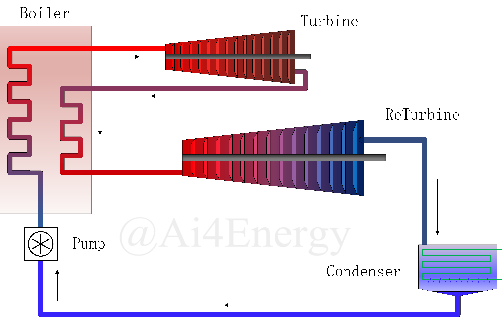
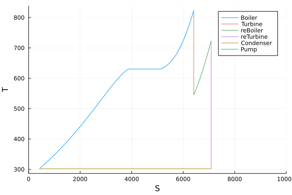
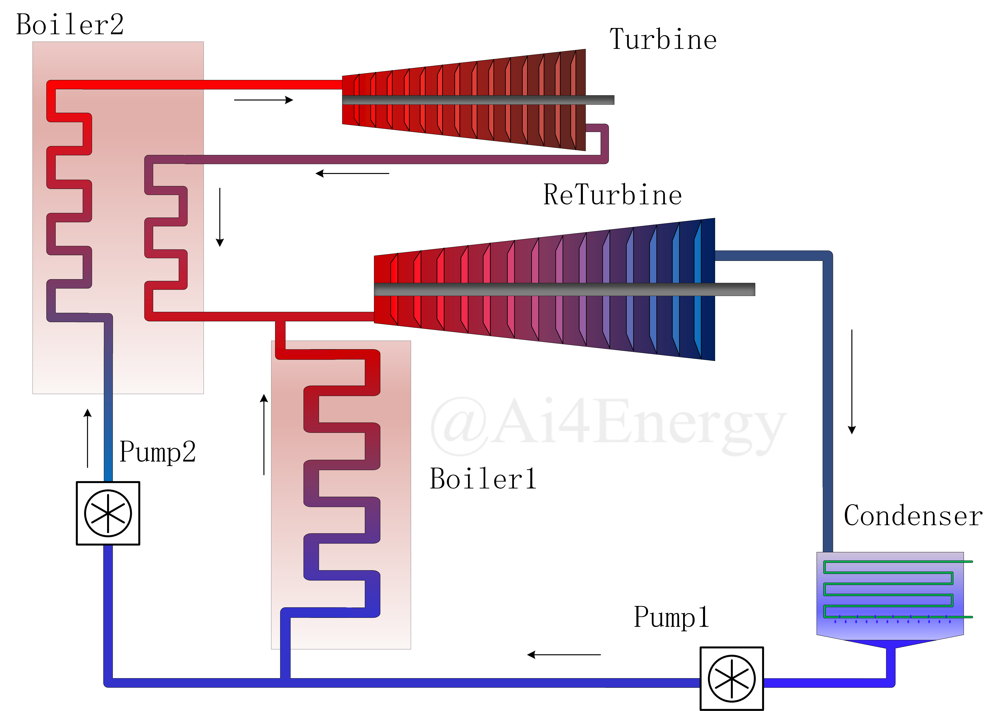
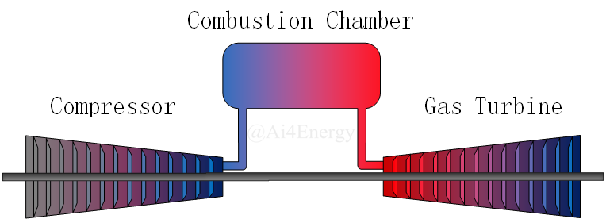
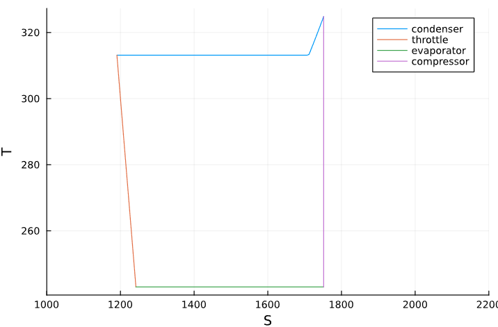

# ThermodynamicCycle System

This page shows 5 examples of `ThermodynamicCycle System`.

3 steps to use ThermodynamicCycle System:

1. Define components
2. Connect components
3. Solve

## Example 1: Rankine Cycle

In this example, we define a variable `x(t)`. It has nothing to do with the cycle. Actually, the meaning of this variable just allows the problem can be modeled by MTK and can be solved by DE. Becasue the cycle is kind of a sequential calculation, and it does not need to be **solved**. So add a `x(t)` to make it a differential equation problem.

  

Parameter of Rankine Cycle:

* Pump supply pressure : 3.0 MPa
* Temperature of Boiler outlet: 450 ℃
* Cooling pressure in condenser: 4 kPa
* State of Water at pump inlet: Saturated water

!!! tip
    If States are Saturated(`"Q_0" or "Q_1"`), then `ThermalStates` has no need to be defined.

```@example 1
using Ai4EComponentLib
using Ai4EComponentLib.ThermodynamicCycle
using DifferentialEquations, ModelingToolkit
using CoolProp

@variables x(t)

@named pump = IsentropicProcess(inter_state="P")
@named pump_P = ThermalStates(state="P", value=3.0E6)

@named boiler = IsobaricProcess(inter_state="T")
@named boiler_T = ThermalStates(state="T", value=450.0 + 273.15)

@named turbine = IsentropicProcess(inter_state="P")
@named turbine_P = ThermalStates(state="P", value=4.0E3)

@named condenser = IsothermalProcess(inter_state="Q_0")

eqs = [
  connect(pump.out, boiler.in, pump_P.node)
  connect(boiler.out, turbine.in, boiler_T.node)
  connect(turbine.out, condenser.in, turbine_P.node)
  connect(condenser.out, pump.in)
  ∂(x) ~ 0
]

@named model = ODESystem(eqs, t, systems=[pump, boiler, turbine, condenser, pump_P, boiler_T, turbine_P])

sys = structural_simplify(model)

prob = ODEProblem(sys, [0], (0, 0))
sol = solve(prob)

q1 = sol[boiler.Δh][1]
w = -sol[turbine.Δh][1] - sol[pump.Δh][1]
η = w / q1
```

And we can get the T-S diagram(tephigram) of the Rankine Cylce.

```julia
plot_sys = [pump, boiler, turbine, condenser];
propx = :s
propy = :T
ss = [sol[getproperty(i.out, propx)][1] for i in plot_sys]
tt = [sol[getproperty(i.out, propy)][1] for i in plot_sys]
using Plots
res = collect(range(ss[1], ss[2], 100))
plot(res, CoolProp.PropsSI.("T", "P", 17.0E6, "S", res, "Water"), label="Boiler", xlim=(0, 10000),ylabel="T",xlabel="S")
plot!(collect(range(ss[2], ss[3], 100)), collect(range(tt[2], tt[3], 100)), label="Turbine")
res = collect(range(ss[3], ss[4], 100))
plot!(res, CoolProp.PropsSI.("T", "P", 5.0E3, "S", res, "Water"), label="Condenser")
plot!(collect(range(ss[4], ss[1], 100)), collect(range(tt[4], tt[1], 100)), label="Pump")
```

The energy consumed by the pump is almost invisible from the diagram. Therefore, the work of the pump is often ignored when calculating the efficiency.


## Example 2: States change over time

If we make one of detemined state(some of states are also supported. Just design as you want) change over time, the problem then becomes a true differential equation problem and we don't need `x(t)` any more.

The meaning of this example is that calculate rankine cycle's thermal efficiency when the pressure in the boiler are [10.0,11.0,12.0,13.0,14.0,15.0,16.0,17.0,18.0,19.0,20.0]MPa

Parameter of Rankine Cycle:

* Pump supply pressure : [10.0,...,20.0] MPa
* Temperature of Boiler outlet: 550 ℃
* Cooling pressure in condenser: 5 kPa
* State of Water at pump inlet: Saturated water

```@example 2
using Ai4EComponentLib
using Ai4EComponentLib.ThermodynamicCycle
using DifferentialEquations, ModelingToolkit
using CoolProp

@named pump = IsentropicProcess(inter_state="P")
@named pump_P = DThermalStates(state="P", value=1.0E6, u0=10.0E6)

@named boiler = IsobaricProcess(inter_state="T")
@named boiler_T = ThermalStates(state="T", value=550.0 + 273.15)

@named turbine = IsentropicProcess(inter_state="P")
@named turbine_P = ThermalStates(state="P", value=5.0E3)

@named condenser = IsothermalProcess(inter_state="Q_0")

eqs = [
  connect(pump.out, boiler.in, pump_P.node)
  connect(boiler.out, turbine.in, boiler_T.node)
  connect(turbine.out, condenser.in, turbine_P.node)
  connect(condenser.out, pump.in)
]


@named model = ODESystem(eqs, t, systems=[pump, boiler, turbine, condenser, pump_P, boiler_T, turbine_P])

sys = structural_simplify(model)

prob = ODEProblem(sys, [], (0, 10), saveat=1)
sol = solve(prob)

q1 = sol[boiler.Δh]
w = -sol[turbine.Δh] - sol[pump.Δh]
η = w ./ q1

```

## Example 3: Reheat Rankine cycle

To be more efficient, consider reheat Rankine Cycle.

Parameter of Reheat Rankine Cycle:

* Pump supply pressure : [18.0,...,10.0] MPa
* Temperature of Boiler outlet: 550 ℃
* Outlet pressure of turbine first stage: 3.0 MPa
* Temperature of ReBoiler outlet: 450 ℃
* Cooling pressure in condenser: 4 kPa
* State of Water at pump inlet: Saturated water

  

```@example 3
using Ai4EComponentLib
using Ai4EComponentLib.ThermodynamicCycle
using DifferentialEquations, ModelingToolkit
using CoolProp

@named pump = IsentropicProcess(inter_state="P")
@named pump_P = DThermalStates(state="P", value=-1.0E5, u0=18.0E6)

@named boiler = IsobaricProcess(inter_state="T")
@named boiler_T = ThermalStates(state="T", value=550+ 273.15)

@named turbine = IsentropicProcess(inter_state="P")
@named turbine_P = ThermalStates(state="P", value=3.0e6)

@named reboiler = IsobaricProcess(inter_state="T")
@named reboiler_T = ThermalStates(state="T", value=450 + 273.15)

@named returbine = IsentropicProcess(inter_state="P")
@named returbine_P = ThermalStates(state="P", value=4.0e3)

@named condenser = IsothermalProcess(inter_state="Q_0")

eqs = [
  connect(pump.out, boiler.in, pump_P.node)
  connect(boiler.out, turbine.in, boiler_T.node)
  connect(turbine.out, reboiler.in, turbine_P.node)
  connect(reboiler.out, returbine.in, reboiler_T.node)
  connect(returbine.out, condenser.in, returbine_P.node)
  connect(condenser.out, pump.in)
]

@named model = ODESystem(eqs, t, systems=[pump, boiler, turbine,
  condenser, pump_P, boiler_T, turbine_P, reboiler,
  reboiler_T, returbine, returbine_P])

sys = structural_simplify(model)

prob = ODEProblem(sys, [], (0, 10), saveat=1)
sol = solve(prob)

q1 = sol[boiler.Δh] .+ sol[reboiler.Δh]
w = -sol[turbine.Δh] - sol[returbine.Δh] - sol[pump.Δh]
η = w ./ q1

```

And T-S diagram.

```julia
plot_sys = [pump, boiler, turbine, reboiler, returbine, condenser];
propx = :s
propy = :T

ss = [sol[getproperty(i.out, propx)][1] for i in plot_sys]
tt = [sol[getproperty(i.out, propy)][1] for i in plot_sys]

using Plots
res = collect(range(ss[1], ss[2], 100))
plot(res, CoolProp.PropsSI.("T", "P", 6.69E6, "S", res, "Water"), label="Boiler", xlim=(0, 10000), ylabel="T", xlabel="S")
plot!(collect(range(ss[2], ss[3], 100)), collect(range(tt[2], tt[3], 100)), label="Turbine")
res = collect(range(ss[3], ss[4], 100))
plot!(res, CoolProp.PropsSI.("T", "P", 0.782e6, "S", res, "Water"), label="reBoiler")
plot!(collect(range(ss[4], ss[5], 100)), collect(range(tt[4], tt[5], 100)), label="reTurbine")
plot!(collect(range(ss[5], ss[6], 100)), collect(range(tt[5], tt[6], 100)), label="Condenser")
plot!(collect(range(ss[6], ss[1], 100)), collect(range(tt[6], tt[1], 100)), label="Pump")

```

  

## Example 4: A Rankine cycle System

Combined with Example1 and Example3. Suppose Boiler1 and Boiler2 have the same steam output. What is the efficiency?



In fact, it can be regarded as the average of two separate Rankine cycle and reheat Rankine cycle.

```@example 4
(0.45644849499826373 + 0.37492352067537854)/2
```

## Example 5: Brayton cycle in Gas Turbine

The method of modeling is the same.

  

Parameter of Brayton cycle:

* Pressure at compressor outlet: 1.212 MPa
* Temperature at compressor inlet: 310 K
* Temperature at combustion chamber outlet: 1573 K
* Pressure at gas turbine outlet: 101 kPa

```@example 5
using Ai4EComponentLib
using Ai4EComponentLib.ThermodynamicCycle
using DifferentialEquations, ModelingToolkit
using CoolProp

@variables x(t)

system = []
@named compressor = IsentropicProcess(inter_state="P", fluid="Air")
@named compressor_P = ThermalStates(state="P", value=0.101e6 * 12)
push!(system, compressor, compressor_P)

@named combustion_chamber = IsobaricProcess(inter_state="T", fluid="Air")
@named combustion_chamber_T = ThermalStates(state="T", value=1573)
push!(system, combustion_chamber, combustion_chamber_T)

@named gas_turbine = IsentropicProcess(inter_state="P", fluid="Air")
@named gas_turbine_P = ThermalStates(state="P", value=0.101e6)
push!(system, gas_turbine, gas_turbine_P)

@named cooling = IsobaricProcess(inter_state="T", fluid="Air")
@named cooling_T = ThermalStates(state="T", value=310)
# @named cooling_P = ThermalStates(state="P", value=0.101e6)
push!(system, cooling, cooling_T)

eqs = [
  connect(compressor.out, combustion_chamber.in, compressor_P.node)
  connect(combustion_chamber.out, gas_turbine.in, combustion_chamber_T.node)
  connect(gas_turbine.out, cooling.in, gas_turbine_P.node)
  connect(cooling.out, compressor.in, cooling_T.node)
  ∂(x) ~ 0
]

@named model = ODESystem(eqs, t, systems=system)

sys = structural_simplify(model)

prob = ODEProblem(sys, [0], (0, 0))
sol = solve(prob)

q1 = sol[combustion_chamber.Δh][1]
w = -sol[gas_turbine.Δh][1] - sol[compressor.Δh][1]
η = w / q1
```

Brayton cycle T-S diagram:

```julia
plot_sys = [compressor, combustion_chamber, gas_turbine, cooling];
propx = :s
propy = :T

ss = [sol[getproperty(i.out, propx)][1] for i in plot_sys]
tt = [sol[getproperty(i.out, propy)][1] for i in plot_sys]
xs = Float64[]
ys = Float64[]
using Plots

res = collect(range(ss[1], ss[2], 100))
plot(res, CoolProp.PropsSI.("T", "P", 0.101e6 * 12, "S", res, "Air"), label="combustion_chamber", xlim=(3500, 6000),ylabel="T",xlabel="S")
plot!(collect(range(ss[2], ss[3], 100)), collect(range(tt[2], tt[3], 100)), label="gas_turbine")
res = collect(range(ss[3], ss[4], 100))
plot!(res, CoolProp.PropsSI.("T", "P", 0.101e6, "S", res, "Air"), label="cooling")
plot!(collect(range(ss[4], ss[1], 100)), collect(range(tt[4], tt[1], 100)), label="compressor")

```

  

## Example 6: ArbitraryProcess Example

With parameters in example 5, we treat process in gas turbine a `ArbitraryProcess`. And suppose all thermal energy is converted into kinetic energy by gas turbine without loss.

* Temperature at gas turbine outlet: 770 K
* Pressure at gas turbine outlet: 101 kPa

```@example 5
using Ai4EComponentLib.ThermodynamicCycle
using DifferentialEquations, ModelingToolkit
using CoolProp

@variables x(t)

system = []
@named compressor = IsentropicProcess(inter_state="P", fluid="Air")
@named compressor_P = ThermalStates(state="P", value=0.101e6 * 12)
push!(system, compressor, compressor_P)

@named combustion_chamber = IsobaricProcess(inter_state="T", fluid="Air")
@named combustion_chamber_T = ThermalStates(state="T", value=1573)
push!(system, combustion_chamber, combustion_chamber_T)

@named gas_turbine = ArbitraryProcess(inter_state="P", fluid="Air")
@named gas_turbine_P = ThermalStates(state="P", value=0.101e6)
@named gas_turbine_T = ThermalStates(state="T", value=770)
push!(system, gas_turbine, gas_turbine_P, gas_turbine_T)

@named cooling = IsobaricProcess(inter_state="T", fluid="Air")
@named cooling_T = ThermalStates(state="T", value=310)
push!(system, cooling, cooling_T)

eqs = [
  connect(compressor.out, combustion_chamber.in, compressor_P.node)
  connect(combustion_chamber.out, gas_turbine.in, combustion_chamber_T.node)
  connect(gas_turbine.out, cooling.in, gas_turbine_P.node, gas_turbine_T.node)
  connect(cooling.out, compressor.in, cooling_T.node)
  ∂(x) ~ 0
]

@named model = ODESystem(eqs, t, systems=system)

sys = structural_simplify(model)

prob = ODEProblem(sys, [0], (0, 0))
sol = solve(prob)

q1 = sol[combustion_chamber.Δh][1]
w = -sol[gas_turbine.Δh][1] - sol[compressor.Δh][1]
η = w / q1
```

## Example 7:  Ideal refrigeration cycle 

In this example, the modeling method is the same as the examples above.It should be mentioned that the working medium used in this ideal refrigeration cycle is R134a.


Parameters of Ideal Refrigeration Cycle:

* Pressure of compressor outlet : 1016.3kPa
* State of R134a at condenser outlet: Saturated liquid
* Pressure of throttle outlet : 83.896kPa
* State of R134a at evaporator outlet: Saturated vapor

```@example 7
using ModelingToolkit, DifferentialEquations
using Ai4EComponentLib
using Ai4EComponentLib.ThermodynamicCycle
using CoolProp

system = []
@named compressor = IsentropicProcess(inter_state="P", fluid="R134a")
@named compressor_P = ThermalStates(state="P", value=1.0163e6)
push!(system, compressor, compressor_P)

@named condenser = IsobaricProcess(inter_state="Q_0", fluid="R134a")
push!(system, condenser)

@named throttle = IsoenthalpyProcess(inter_state="P", fluid="R134a")
@named throttle_P = ThermalStates(state="P", value=8.3896e4)
push!(system, throttle, throttle_P)

@named evaporator = IsobaricProcess(inter_state="Q_1", fluid="R134a")
push!(system, evaporator)

eqs = [
    connect(compressor.out, condenser.in, compressor_P.node)
    connect(condenser.out, throttle.in)
    connect(throttle.out, evaporator.in, throttle_P.node)
    connect(evaporator.out, compressor.in)
]

@named model = ODESystem(eqs, t, systems=system)

sys = structural_simplify(model)

prob = ODAEProblem(sys, [], (0, 0))
sol = solve(prob)

w = sol[compressor.Δh][1]
ql = sol[evaporator.Δh][1]
ε = ql / w
```

Ideal refrigeration cycle T-S diagram:

```julia
plot_sys = [compressor, condenser, throttle, evaporator];
propx = :s
propy = :T

ss = [sol[getproperty(i.out, propx)][1] for i in plot_sys]
tt = [sol[getproperty(i.out, propy)][1] for i in plot_sys]

using Plots
res = collect(range(ss[1], ss[2], 100))
plot(res, CoolProp.PropsSI.("T", "P", 1.0163e6, "S", res, "R134a"), label="condenser", xlim=(1000,2200), ylabel="T", xlabel="S")
plot!(collect(range(ss[2], ss[3], 100)), collect(range(tt[2], tt[3], 100)), label="throttle")
res = collect(range(ss[3], ss[4], 100))
plot!(res, CoolProp.PropsSI.("T", "P",8.3896e4, "S", res, "R134a"), label="evaporator")
plot!(collect(range(ss[4], ss[1], 100)), collect(range(tt[4], tt[1], 100)), label="compressor")
```

